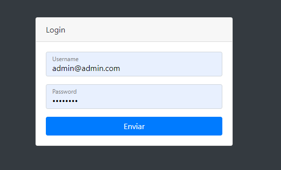

# Blog build with laravel and bootstrap

A simple and fast blog fully made with Laravel and Bootstrap.

---

- # front-end 
      - main page show the lastest posts
      - nav link for post type articles
      - nav link for post type news
      - login
      - register
      - Post Coments ( Only registered user may post comments )

- # Back-end
      - Admin login page
      - Admin Dashboard
      - Blog Settings
      - Add/Remove Categories
      - Add/Remove Users
      - View/Add/Delele Posts

## Front page

---
---

## User Register

---
---

## User login

---
---

## Add Posts

---
---

## Admin login

---
---

## Admin DashBoard

---
---
## Admin blog settings

---
---

